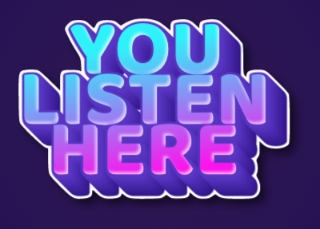

_HashiCorp R&D Hackathon March 2022_

## What?

Audio streaming over the Net from my input to your outputs, from scratch in Go.

## Why?

I play piano a bit and want to perform for friends without signing up for anything.  My usual communication channels are not very good quality for this, and writing my own little audio streamer seems like a fun challenge!
